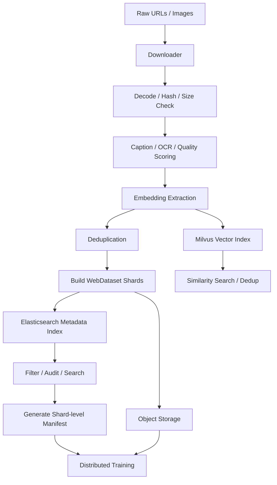

可以，最后给你一个**轻量、清晰、可落地版**。

我理解你的最终架构应该是：

```text
图片和 caption 最终一起打进 WebDataset shard；
ES 管训练前检索、筛选、审核；
Milvus 管相似检索和去重；
Manifest 只保存本次训练用哪些 shard。
```

---

# 10B 图像预训练数据 Pipeline

## 1. 数据下载

原始输入：

```text
url
raw_caption
source
license
crawl_time
```

下载流程：

```text
URL 列表
  ↓
下载图片
  ↓
decode 校验
  ↓
计算 sha256 / phash
  ↓
保存为本地临时样本
```

每个样本生成：

```text
image_id
image_bytes
raw_caption
source
sha256
phash
width
height
```

---

## 2. 打标 / 清洗

对每张图片做基础标注：

```text
caption 清洗 / 重写
language 检测
NSFW 分数
aesthetic 分数
watermark 分数
OCR 文本
质量检测
```

可选再做 embedding：

```text
CLIP embedding
DINO embedding
SigLIP embedding
```

用途：

```text
相似图搜索
近重复去重
聚类
数据多样性采样
benchmark 泄漏检测
```

---

## 3. 打包存储

训练数据实体用 WebDataset tar shard。

一个 shard 里面这样：

```text
shard-000001.tar

000001.jpg
000001.json

000002.jpg
000002.json

000003.jpg
000003.json
```

每个 json 里放：

```json
{
  "image_id": "img_000001",
  "caption": "a dog running on the beach",
  "source": "web",
  "language": "en",
  "width": 1024,
  "height": 768,
  "aesthetic_score": 6.4,
  "nsfw_score": 0.01
}
```

对象存储结构：

```text
s3://dataset/

  shards/
    shard-000001.tar
    shard-000002.tar
    shard-000003.tar

  manifests/
    train_v1.txt
    train_v2.txt

  embeddings/
    clip_v1/
      part-000001.parquet
```

---

## 4. Elasticsearch 管理索引

ES 里不存图片，只存可搜索 metadata。

Index：

```text
images-v1
```

Document：

```json
{
  "image_id": "img_000001",
  "shard_path": "s3://dataset/shards/shard-000001.tar",
  "shard_key": "000001",

  "caption": "a dog running on the beach",
  "source": "web",
  "language": "en",

  "width": 1024,
  "height": 768,

  "sha256": "xxx",
  "phash": "yyy",

  "aesthetic_score": 6.4,
  "nsfw_score": 0.01,
  "watermark_score": 0.12,

  "status": "valid",
  "duplicate_group_id": "dup_123",
  "created_at": "2026-05-27"
}
```

ES 负责：

```text
筛选中文数据
筛选 NSFW < 0.1
筛选 aesthetic_score > 5
搜索 caption
统计 source 分布
审核低质数据
查 duplicate
定位某个 image_id 在哪个 shard
```

ES 不负责：

```text
训练读取
图片存储
向量检索
长期版本复现
```

---

## 5. Milvus 向量索引

Milvus 只放向量和少量字段。

Collection：

```text
image_clip_v1
```

Schema：

```text
image_id
vector
shard_path
shard_key
status
```

用途：

```text
以图搜图
embedding 去重
找相似图片
聚类
构建多样性数据集
```

比如去重流程：

```text
新图片 embedding
  ↓
Milvus 搜 topK 相似图片
  ↓
similarity > threshold
  ↓
标记 duplicate_group_id
  ↓
更新 ES status / duplicate 信息
```

---

## 6. Manifest

Manifest 不存每张图，也不存 caption。

它只固定：

```text
本次训练到底用了哪些 shard
```

例如：

```text
train_v1.txt
```

内容：

```text
s3://dataset/shards/shard-000001.tar
s3://dataset/shards/shard-000002.tar
s3://dataset/shards/shard-000003.tar
```

稍微丰富一点可以是：

```text
shard_path,num_samples,weight,tag
s3://dataset/shards/shard-000001.tar,10000,1.0,zh_clean
s3://dataset/shards/shard-000002.tar,10000,1.0,zh_clean
s3://dataset/shards/shard-000003.tar,8000,0.5,synthetic
```

生成方式：

```text
ES 查询筛选
  ↓
得到符合条件的 shard
  ↓
写成 train_v1.manifest
```

例如：

```text
language = zh
AND nsfw_score < 0.1
AND aesthetic_score > 5
AND status = valid
```

---

# 7. 训练流程

训练时不查 ES，不查 Milvus。

只做：

```text
读取 manifest
  ↓
shuffle shard 顺序
  ↓
读取 tar shard
  ↓
shard 内 shuffle sample
  ↓
读取 jpg + json
  ↓
得到 image + caption
  ↓
训练
```

也就是：

```text
manifest 决定读哪些 shard
shard 里面自带 image + caption
```

这样既支持 shuffle，又避免训练时访问数据库。

---

# 8. 修改 / 删除数据

## 逻辑删除

如果某张图有问题：

```text
ES status = deleted
```

然后下次生成 manifest 时排除：

```text
status != deleted
```

旧 shard 可以暂时不动。

## 物理删除

如果涉及版权/合规，必须真正删除：

```text
找到 shard_path
  ↓
重写这个 shard
  ↓
去掉对应 image/json
  ↓
生成新 shard
  ↓
更新 ES
  ↓
重新生成 manifest
```

---

# 9. 最终架构图

```text
Raw URLs / Images
        ↓
Downloader
        ↓
Hash / Decode / Quality Check
        ↓
Caption / OCR / Tagging
        ↓
Embedding Extraction
        ↓
Deduplication
        ↓
WebDataset Shards
        ↓
Object Storage
        ↓
同步 metadata 到 ES
        ↓
同步 embedding 到 Milvus
        ↓
ES 筛选训练数据
        ↓
生成 shard-level Manifest
        ↓
Training
```

---

# Mermaid 图



---

# 最终一句话

最简洁优雅的设计就是：

```text
WebDataset shard 存 image + caption；
Object Storage 存 shard；
ES 管 metadata 搜索和审核；
Milvus 管 embedding 相似检索；
Manifest 固定每次训练用哪些 shard。
```

也就是：

```text
训练数据实体在 shard，
数据治理在 ES，
相似检索在 Milvus，
训练版本在 manifest。
```

这个方案比“Parquet 主表 + patch + 多层湖表”轻很多，也更适合你现在这个 10B 图像预训练场景。
